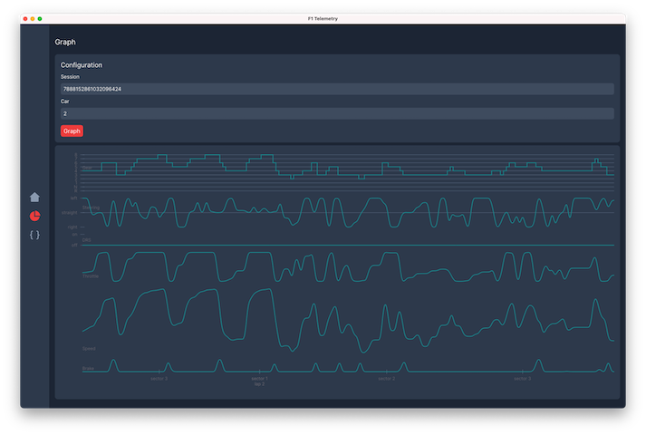

# Formula 1 Telemetry Companion

A telemetry processor for the official Formula 1 games.

## Features and Use Cases



## Usage

Work in progress.

### CLI

```shell
# Start the server with the bundled web UI listening on UDP 127.0.0.1:20777 and TCP 127.0.0.1:20777
./cli start --output database --web
```

## Development

There are some rough guidelines available below for now.

### Frontend

The frontend is built with React, Tailwind CSS and Vite. It resides in `frontend`. Entrypoints
are `frontend/main.tsx` for the app, `frontend/main.css` for the style.

```shell
# Install dependencies
yarn install

# Run the development server on http://localhost:3000
yarn run dev

# Format code
yarn run format

# Build the frontend
yarn run build
```

### CLI

The CLI's entrypoint is `cmd/cli/main.go`. It handles parsing CLI flags and arguments and invokes one
of the supported _actions_ found in `internal/cli`.

```shell
# Build the CLI
go build -o cli cmd/cli/*.go
```

### APP

The app's entrypoint is `app.go`. It handles parsing CLI flags and arguments and is mostly a wrapper for `internal/app/action.go`.

```shell
# Install Wails
go install github.com/wailsapp/wails/v2/cmd/wails@latest

# Run Wails in dev mode
wails dev

# Build the app in debug mode (includes DevTools accessible via right click)
wails build -debug

# Build the app
wails build
```
